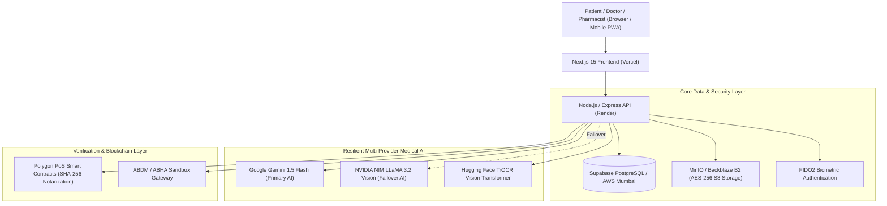

# 🏥 MediVault AI — Next-Gen Unified Healthcare Records & Clinical Intelligence

<p align="center">
  
</p>

<p align="center">
  <strong>An enterprise-grade, ABHA-compliant personal health records (PHR) vault, AI-powered diagnostic copilot, and blockchain-notarized digital prescription ecosystem.</strong>
</p>

<p align="center">
  <a href="https://medi-vault-seven-lyart.vercel.app"></a>
</p>

<p align="center">
  
  
  
  
  
  
  
  
  
  
  
</p>

---

## 🏛️ System Architecture



---

## 🚀 Key Features & Portals

### 1. 🧑‍⚕️ Patient Health Vault (`/patient`)
* **Unified Document Vault:** Upload, OCR-process, and securely store blood reports, radiology scans (MRI/CT/X-Ray), discharge summaries, and prescriptions with SHA-256 tamper-evident checksums.
* **Chronological Health Timeline:** Automatic grouping of medical events into continuous clinical episodes and condition journeys.
* **AI Medical Copilot:** Interactive clinical assistant powered by a resilient dual-engine (Google Gemini + NVIDIA NIM failover) with red-flag critical symptom triage.
* **Offline Emergency Pass & Trauma QR:** Instant offline-capable QR card rendering allergies, blood group, emergency contacts, and critical vitals for first responders.
* **Digital Prescription Hub:** Full medication breakdown with automated browser push alarm notifications and **Pradhan Mantri Jan Aushadhi generic cost-saving comparisons** (saving up to 85% on medicine costs).
* **ABHA & DigiLocker KYC:** 14-digit ABHA Card generator (`@abdm`), Aadhaar OTP mock verification, and DigiLocker health document sync.
* **DPDPA 2023 Account Erasure:** Automated one-click right-to-be-forgotten privacy pipeline permanently scrubbing records across DB, S3 storage, and caches under Section 12 of India's DPDPA 2023.

### 2. 🩺 Doctor Consultation Station (`/doctor`)
* **Patient Management & Consent Ledger:** Request, inspect, and revoke granular time-bound patient record access (Full Vault, Lab Only, Emergency Only).
* **ER Trauma Break-Glass Protocol:** Emergency override scanning patient QR passes for life-saving triage with mandatory reason logging and audit trails.
* **NMC-Compliant Digital Rx Writer:** Prescription authoring studio with drug formulary auto-complete, dosage schedules (`1-0-1`), meal timings, and contraindication warning checks.
* **Polygon Blockchain Notarization:** Prescriptions are hashed and notarized onto the Polygon blockchain with tamper-proof QR codes preventing prescription forgery and doctor shopping.
* **AI Diagnostic Copilot:** Differential diagnosis suggestions, interaction alerts, and clinical literature summaries.

### 3. 🛡️ Administrative Operations Console (`/admin`)
* **Live System Telemetry:** Real-time uptime monitoring, active database connection pool stats, and MinIO storage metrics.
* **AI Model Performance & Latency Tracker:** Gemini vs NVIDIA NIM invocation rates, latency percentiles, token usage, and automatic failover counters.
* **Drug Formulary Management:** Full WHO Essential Medicines List (WHO EML) and National List of Essential Medicines (NLEM 2022) catalog with real-time Jan Aushadhi pricing.
* **Clinical Audit Trail:** Comprehensive, immutable event log capturing all PHI access, emergency break-glass actions, logins, and downloads.
* **Interactive Healthcare Error Simulator:** Built-in fault injection modal allowing admins to test system resilience against database drops, AI timeouts, network interruptions, and malformed inputs.

### 4. 🔍 Public Prescription Verification Hub (`/verify`)
* **Zero-Login Verification:** Accessible to retail pharmacists and patients without requiring an account.
* **Live Camera QR Scanner:** In-browser hardware camera scanner powered by `jsQR` with image drag-and-drop fallback.
* **Cryptographic Proof Validation:** Verifies NMC doctor digital signature, validity period, and Polygon blockchain notarization timestamp.
* **Dispensation Locking:** One-time dispensation lock preventing double-redemption of narcotics and antibiotic prescriptions.

---

## 🛠️ Technology Stack

| Domain | Technology / Framework |
| :--- | :--- |
| **Frontend** | Next.js 15 (App Router, Turbopack), React 19, TypeScript, Tailwind CSS, Lucide Icons, Framer Motion |
| **PWA & Offline** | Progressive Web App (PWA), Service Workers (`sw.js`), Web Push Notifications (`VAPID`), IndexedDB |
| **Backend** | Node.js 20 LTS, Express 5, TypeScript, Zod Schema Validation, Winston Logger |
| **Authentication** | Supabase Auth (Email/Password, Google OAuth), WebAuthn FIDO2 Passkeys (`@simplewebauthn/server`), Role-Based Access Control (RBAC) |
| **Database** | PostgreSQL on Supabase (AWS ap-south-1 Mumbai) with Row Level Security (RLS) & Connection Pooling |
| **AI / OCR Engines** | Google Gemini 1.5 Flash-Lite, NVIDIA NIM (`meta/llama-3.2-11b-vision-instruct`), HuggingFace TrOCR (`chinmays18/medical-prescription-ocr`), Tesseract OCR |
| **Object Storage** | S3-Compatible Storage (MinIO locally / Backblaze B2 in production) with pre-signed secure URLs |
| **Blockchain** | Polygon PoS Smart Contracts (`ethers.js`), Keccak-256 / SHA-256 Hashing |
| **Containerization** | Docker, Docker Compose, Multi-stage standalone Alpine images |

---

## 💻 Local Development Setup

### Prerequisites
* **Node.js:** v20.x or higher
* **npm:** v10.x or higher
* **Docker & Docker Compose** *(optional, for containerized run)*

### Method 1: Running Directly with Node.js

#### 1. Clone the Repository
```bash
git clone https://github.com/aniketvishwakarma-11/MediVault.git
cd MediVault
```

#### 2. Backend Setup
```bash
cd backend
npm install
cp .env.example .env   # Configure your Supabase DB & AI API Keys
npm run dev            # Starts Express API on http://localhost:5000
```

#### 3. Frontend Setup
```bash
cd ../frontend
npm install
npm run dev            # Starts Next.js App on http://localhost:3000
```

---

### Method 2: Running with Docker (1-Command Full Stack)

Run the entire ecosystem (Frontend, Backend, MinIO S3 Storage, and AI OCR Engine) in isolated containers:

```bash
docker compose up --build -d
```

#### Local Services Access:
* 🌐 **Web Application:** `http://localhost:3000`
* 🔌 **Backend REST API:** `http://localhost:5000/health`
* 📂 **MinIO S3 Web Console:** `http://localhost:9001` *(User: `minioadmin` | Pass: `minioadmin`)*
* 🧠 **AI Prescription OCR Docs:** `http://localhost:8001/docs`

---

## 🔒 Healthcare Regulatory Compliance & Standards

* 🇮🇳 **ABDM & ABHA (Ayushman Bharat Digital Mission):** Aligned with NHA sandbox guidelines for PHR applications, 14-digit ABHA numbering, and M1/M2/M3 health data exchange workflows.
* 🇮🇳 **DPDPA 2023 (Digital Personal Data Protection Act):** Strict purpose limitation, explicit consent grants, and automated Section 12 Right to Erasure.
* 🇺🇸 **HIPAA (Health Insurance Portability and Accountability Act):** AES-256 document encryption at rest, TLS 1.3 in transit, granular RBAC, and immutable audit logs.
* 🛡️ **CERT-In Cyber Security Guidelines:** Multi-factor authentication, biometric passkeys, rate limiting, and sanitized error boundaries preventing database or clinical data leakage.

---

## 👥 Demo Credentials for Testing

To explore all role-based portals on the [live website](https://medi-vault-seven-lyart.vercel.app):

| Portal | Demo Access Method | What You Can Explore |
| :--- | :--- | :--- |
| **Patient Portal** | Click **"Explore Demo"** on `/auth` (or log in) | 22 sample documents, Timeline, AI Copilot, ABHA Card, Alarms |
| **Doctor Portal** | Click **"Doctor Demo"** on `/auth` | ER Trauma Scanner, Patient Consent list, Write Prescription |
| **Admin Console** | Click **"Admin Demo"** on `/auth` | System telemetry, Drug formulary, Audit logs, Error Simulator |
| **Verify Rx** | Visit `/verify` and click **"Test Sample Prescription"** | Pharmacist QR verification and Jan Aushadhi generic price lookup |

---

## 📜 License

This project is licensed under the **MIT License** — see the [LICENSE](LICENSE) file for details.

---

<p align="center">
  <strong>Developed with ❤️ for National & Global Healthcare Interoperability</strong><br />
  <sub>MediVault — Decentralized, Intelligent & Human-Centric Medical Data Infrastructure</sub>
</p>
