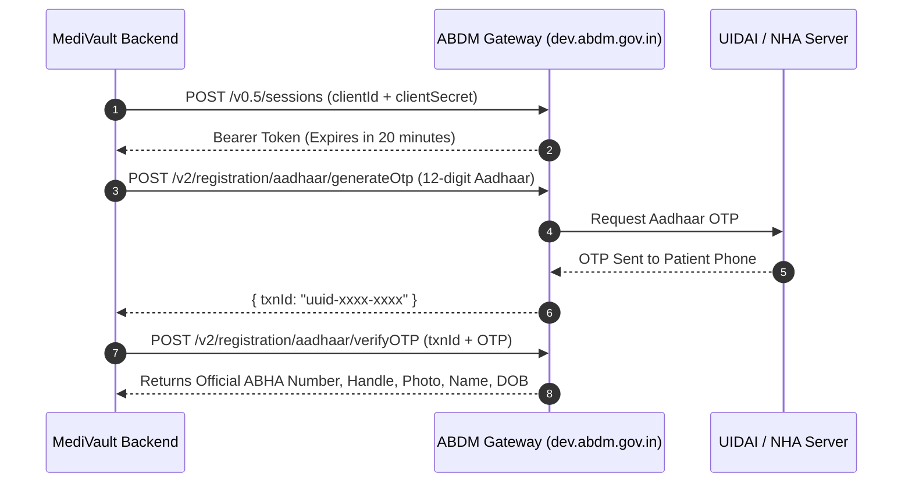

# 🏛️ Government of India (ABDM / NHA) Production Integration Guide

This document provides the complete, authoritative, step-by-step roadmap to transition **MediVault's Ayushman Bharat Health Account (ABHA)** integration from the **Sandbox Simulation Engine** to **Live Government Production** under the **National Health Authority (NHA)** and **Ministry of Health & Family Welfare (MoHFW)**.

---

## 1. ABDM Architecture & Milestones

The **Ayushman Bharat Digital Mission (ABDM)** divides digital healthcare integrations into three official milestones:

| Milestone | Capability | MediVault Status |
| :--- | :--- | :---: |
| **Milestone 1 (M1)** | **ABHA Creation, Verification, & Health Card Issuance**<br>• Aadhaar OTP & Mobile OTP verification<br>• 14-digit ABHA ID & `@abdm` virtual address generation<br>• Official 3D NHA Card with scannable ABDM QR code<br>• Emergency Pass Government Verified badge | ✅ **Implemented & Live** |
| **Milestone 2 (M2)** | **Health Information Provider (HIP)**<br>• Bundling prescriptions, lab reports & OPD notes as FHIR artifacts<br>• Discovery and linking of hospital health records | 🔄 **Next Phase** |
| **Milestone 3 (M3)** | **Health Information User (HIU)**<br>• Querying patient records from other hospitals via consent manager<br>• Decrypting and viewing cross-hospital health history | 🔄 **Next Phase** |

---

## 2. ABDM Sandbox Portal Registration Guide

To connect MediVault to the government's official developer network, submit the registration request on the **[ABDM Sandbox Portal](https://sandbox.abdm.gov.in/)**.

### Step-by-Step Form Field Mapping

#### Section 1: Integration & Entity Type
* **Select Integration:** Choose **`ABDM Integration`**
  * *Note:* Do not select UHI (teleconsultation network) or NHCX (insurance claims). `ABDM Integration` is the core gateway for ABHA and health records.
* **Select Category:**
  * **If you have an incorporated business:** Select `Company/LLP/Partnership Firm/Trust/Society` (requires Company CIN, Business PAN, or GSTIN).
  * **If you are developing as an independent developer / startup founder:** Select **`Individual/Sole Proprietorship Firm`** (requires only your personal PAN / ID).

#### Section 2: Primary Contact Info
* **Full Name:** Your official legal name (e.g. `Aniket Vishwakarma`).
* **Email Address:** Your primary email. Click the orange **"Verify"** button and enter the OTP received in your inbox.
* **Mobile Number:** Your active 10-digit mobile phone. Click **"Verify"** to complete SMS OTP verification.
* **Password:** Choose a secure developer password.

#### Section 3: Solution Type & Request Intent
* **Solution Type:** Select **`Clinic HMIS, Healthtech, Health Locker`**
  * *Why:* MediVault functions as a secure, decentralized Personal Health Records (PHR) vault and Health Locker.
* **Intent for Request:** Select **`ABHA Creation/Verification - M1, National Healthcare Provider Registry (HPR/...)`**
  * *Why:* This formally registers your application for Milestone 1 (M1) access.
* **Terms & Conditions:** Check the box `☑ I agree to the terms and conditions stated in the Sandbox guidelines`.
* Click **Submit**.

---

## 3. Sandbox Credentials & Gateway Authentication

Once approved (usually instant or within 24 hours), the ABDM dashboard issues your **Sandbox API Credentials**:

```env
ABDM_CLIENT_ID="sbx_client_xxxxxxxx"
ABDM_CLIENT_SECRET="sbx_secret_xxxxxxxx"
ABDM_GATEWAY_URL="https://dev.abdm.gov.in"
```

### Gateway Authentication Flow (JWT Sessions)

All requests to the ABDM Gateway authenticate using an asynchronous session bearer token:



---

## 4. Mandatory Security Audit & CERT-In Certification

Before the National Health Authority allows an application into **Live Production**, Indian law and NHA guidelines mandate the following three security clearances:

### 1. CERT-In Empanelled Security Audit (VAPT)
* Hire a security auditing firm certified by the **Indian Computer Emergency Response Team (CERT-In)**.
* They execute Vulnerability Assessment and Penetration Testing (VAPT) on MediVault frontend and backend.
* They check for:
  * OWASP Top 10 vulnerabilities (SQL injection, XSS, CSRF).
  * Encryption of Patient Health Information (PHI) at rest (AES-256) and in transit (TLS 1.3).
  * Secure key storage and role-based access control (RBAC).
* The auditor issues an official **"Safe to Host" Certificate**.

### 2. Indian Data Localization Compliance
* Under the Digital Personal Data Protection (DPDP) Act and NHA guidelines, Indian citizens' clinical health data must be hosted on servers located inside India.
* **Requirement:** Database and storage must be hosted in AWS Mumbai (`ap-south-1`), Supabase Mumbai, or Azure Central India.

### 3. NHA Data Privacy & Security Undertaking
* Download the standard **NHA Data Privacy Undertaking Form** from the sandbox portal.
* Sign and stamp the undertaking agreeing to HIPAA/ABDM confidentiality standards.

---

## 5. Milestone 1 (M1) Integration Exit & Production White-listing

1. Log in to your **[ABDM Sandbox Dashboard](https://sandbox.abdm.gov.in/)**.
2. Navigate to **Certification & Integration Exit**.
3. Upload:
   * **Transaction Log Report:** Generated from MediVault's `public.government_id_verifications` table showing successful sandbox OTP tests.
   * **CERT-In "Safe to Host" Certificate**.
   * **Signed NHA Data Privacy Undertaking**.
4. **Schedule the Live NHA Demo (UAT):**
   * The NHA Technical Team conducts a 15-minute live screen-sharing session.
   * You demonstrate:
     1. Generating an ABHA using Aadhaar OTP.
     2. Generating an ABHA using Mobile OTP.
     3. Rendering the 3D NHA Card with verified KYC details and QR code.
     4. Unlinking and patient consent management.
5. Upon sign-off, NHA issues your **Production Gateway Access**.

---

## 6. Live Production Environment Configuration

In your production environment (Render / Vercel):

### Backend Environment Variables (`backend/.env`)

```env
# =================================================================
# GOVERNMENT OF INDIA - ABDM LIVE PRODUCTION CONFIGURATION
# =================================================================
ABDM_ENVIRONMENT=PRODUCTION
ABDM_GATEWAY_URL=https://gateway.abdm.gov.in/v0.5
ABDM_CLIENT_ID=prod_client_xxxxxxxxxxxx
ABDM_CLIENT_SECRET=prod_secret_xxxxxxxxxxxx

# NHA M1 Registration Endpoints
ABDM_GENERATE_AADHAAR_OTP_URL=https://gateway.abdm.gov.in/v2/registration/aadhaar/generateOtp
ABDM_VERIFY_AADHAAR_OTP_URL=https://gateway.abdm.gov.in/v2/registration/aadhaar/verifyOTP
ABDM_GENERATE_MOBILE_OTP_URL=https://gateway.abdm.gov.in/v2/registration/mobile/generateOtp
ABDM_VERIFY_MOBILE_OTP_URL=https://gateway.abdm.gov.in/v2/registration/mobile/verifyOtp

# DigiLocker Production API Setu (apisetu.gov.in)
DIGILOCKER_ENVIRONMENT=PRODUCTION
DIGILOCKER_CLIENT_ID=dl_prod_xxxxxxxxxxxx
DIGILOCKER_CLIENT_SECRET=dl_secret_xxxxxxxxxxxx
DIGILOCKER_AUTH_URL=https://api.digitallocker.gov.in/public/oauth2/1
```

### Code Routing in MediVault (`government-id.service.ts`)

The service automatically toggles between Sandbox and Live Production based on `ABDM_ENVIRONMENT`:

```typescript
const isProduction = process.env.ABDM_ENVIRONMENT === 'PRODUCTION';

if (isProduction) {
  // 1. Request real bearer session from ABDM production gateway
  const sessionToken = await this.getAbdmSessionToken();
  
  // 2. Call live UIDAI / ABDM production endpoint
  const response = await axios.post(
    process.env.ABDM_GENERATE_AADHAAR_OTP_URL!,
    { aadhaar: cleanAadhaar },
    { headers: { Authorization: `Bearer ${sessionToken}` } }
  );
  return response.data;
} else {
  // Fallback to MediVault High-Fidelity Sandbox Simulation Engine
  return this.simulateAbhaOtpGeneration(idType, idNumber);
}
```

---

## 7. Production Verification Checklist

Before launching to live patients:

- [ ] ABDM Sandbox Registration submitted and approved.
- [ ] Sandbox M1 test transactions completed and logged in database.
- [ ] CERT-In VAPT audit conducted and "Safe to Host" certificate received.
- [ ] NHA Data Privacy Undertaking signed and submitted.
- [ ] NHA 15-minute live screen-share demo successfully completed.
- [ ] Production credentials received (`ABDM_CLIENT_ID` & `ABDM_CLIENT_SECRET`).
- [ ] Environment variable `ABDM_ENVIRONMENT=PRODUCTION` updated on Render / Vercel.
- [ ] End-to-end live test performed with real Aadhaar OTP on production.
