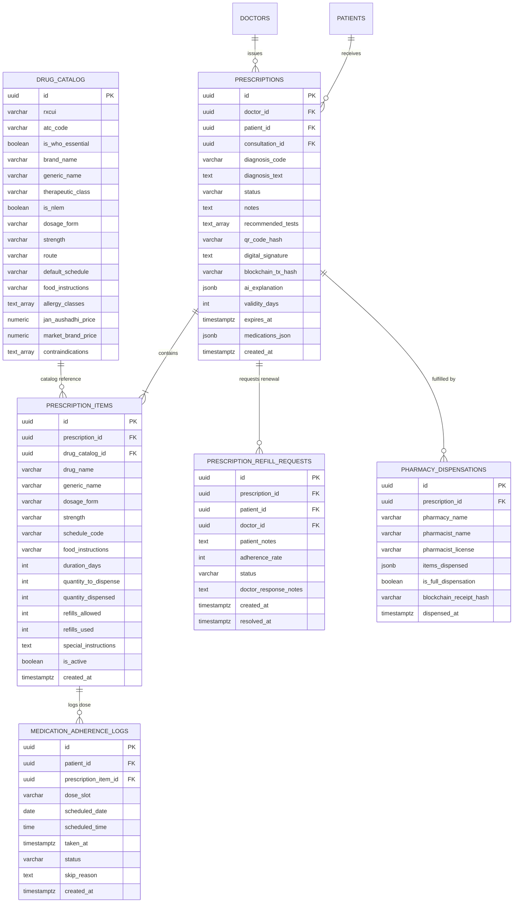
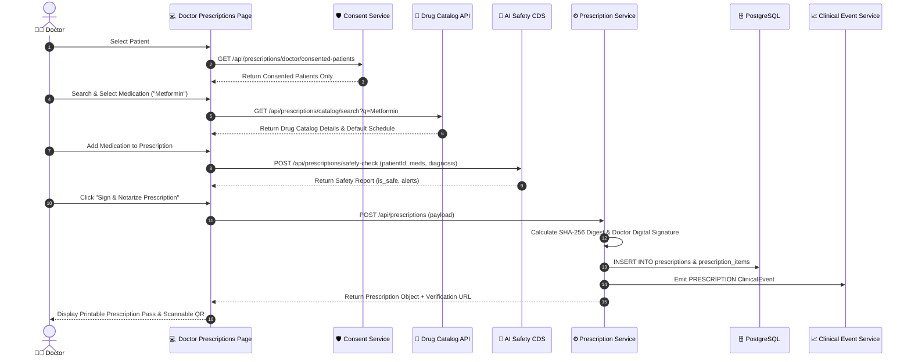
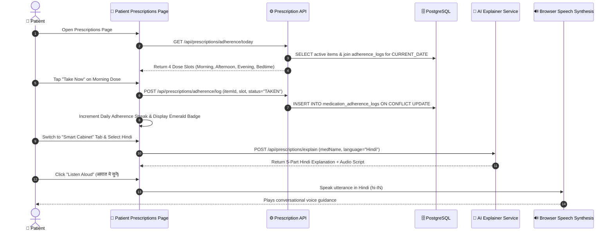
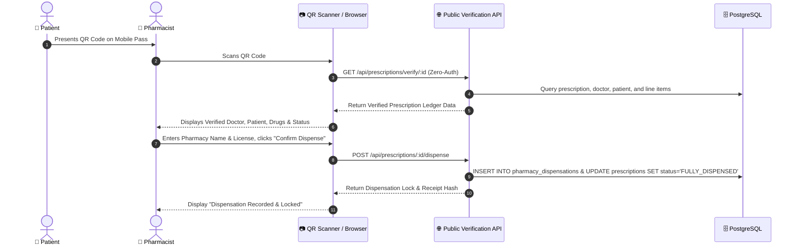

# MediVault Prescription Ecosystem: Comprehensive A-to-Z Architecture & Technical Specification

> **Target Audience:** AI Agents, Full-Stack Software Engineers, Clinical Informaticians, System Architects  
> **Repository:** `aniketvishwakarma-11/MediVault`  
> **Scope:** Doctor-Side Studio, Patient-Side Cabinet & Dosing Schedule, Public Pharmacy Verification & Dispensation, Clinical Decision Support (CDS), AI Explainers, Adherence Engine, and Database Models.

---

## Table of Contents

1. [Executive Summary & High-Level Architecture](#1-executive-summary--high-level-architecture)
2. [Data Model & Database Schema (PostgreSQL)](#2-data-model--database-schema-postgresql)
3. [Drug Catalog & Pharmacopoeia Standardization](#3-drug-catalog--pharmacopoeia-standardization)
4. [Backend Architecture & API Endpoints](#4-backend-architecture--api-endpoints)
5. [Doctor-Side Ecosystem (Prescription Studio)](#5-doctor-side-ecosystem-prescription-studio)
6. [Patient-Side Ecosystem (Smart Cabinet & Adherence)](#6-patient-side-ecosystem-smart-cabinet--adherence)
7. [Pharmacy Fulfillment & Public QR Verification](#7-pharmacy-fulfillment--public-qr-verification)
8. [AI Clinical Decision Support & Patient Explainers](#8-ai-clinical-decision-support--patient-explainers)
9. [Longitudinal Timeline & Clinical Event Integration](#9-longitudinal-timeline--clinical-event-integration)
10. [End-to-End Execution & Data Flows (Sequence Diagrams)](#10-end-to-end-execution--data-flows-sequence-diagrams)
11. [Security, Cryptographic Notarization & Consent Enforcement](#11-security-cryptographic-notarization--consent-enforcement)
12. [Offline Resilience, Mock Modes & Error Recovery](#12-offline-resilience-mock-modes--error-recovery)

---

## 1. Executive Summary & High-Level Architecture

The MediVault Prescription Ecosystem is a production-grade, dual-sided digital clinical prescribing and patient medication adherence system. It bridges the gap between structured clinical decision-making by healthcare providers and actionable, understandable health self-management by patients.

```
┌────────────────────────────────────────────────────────────────────────┐
│                        MEDIVAULT RX ECOSYSTEM                          │
├──────────────────────────┬───────────────────┬─────────────────────────┤
│       DOCTOR SIDE        │   CORE BACKEND    │      PATIENT SIDE       │
│  (Clinical Studio)       │   & AI ENGINE     │  (Cabinet & Adherence)  │
├──────────────────────────┼───────────────────┼─────────────────────────┤
│ • Strict Consent Gating  │ • Drug Catalog    │ • Daily 4-Slot Schedule │
│ • WHO EML / NLEM Search  │   (RxNorm/IP/ATC) │ • 1-Tap Adherence Log   │
│ • Live CDS Safety Screen │ • Gemini AI CDS   │ • 5-Part Plain Explainer│
│ • Structured Dosing Regs │ • SHA-256 Digest  │ • Hindi Multi-Language  │
│ • Digital Signing & QR   │ • Timeline Event  │ • Web Speech TTS Audio  │
│ • Refill Queue Approval  │ • Public Ledger   │ • Jan Aushadhi Savings  │
│ • Revoke / Delete Modals │ • Adherence Stats │ • 1-Click Refill Req    │
└──────────────────────────┴───────────────────┴─────────────────────────┘
                                   │
                                   ▼
             ┌───────────────────────────────────────────┐
             │         PUBLIC VERIFICATION & LEDGER      │
             │   /verify/rx/:id (Zero-Auth Pharmacy)     │
             │  • QR Authenticity • Anti-Double Dispense │
             └───────────────────────────────────────────┘
```

### Core Problems Solved:
1. **Prescription Legibility & Medication Errors:** Replaces unstructured paper/free-text notes with standardized Drug Catalog items (RxNorm, WHO Essential Medicines List, and Indian Pharmacopoeia / NLEM).
2. **Clinical Safety & Adverse Interactions:** Real-time AI screening of proposed medications against the patient's existing longitudinal medications, documented allergies, and recent laboratory findings (e.g., eGFR, serum creatinine, HbA1c).
3. **Health Literacy & Adherence:** Deconstructs complex dosing schedule codes (`1-0-1`, `1-0-0`, `0-0-1`, `1-1-1`) into simple Morning/Afternoon/Evening/Bedtime checklists, coupled with 5-part plain-language explainers and Text-to-Speech (TTS) in English and Hindi.
4. **Economic Accessibility:** Real-time generic price comparison displaying Pradhan Mantri Bhartiya Janaushadhi Pariyojana (PMBJP) pricing vs. branded commercial equivalents, calculating potential cost savings.
5. **Anti-Tampering & Anti-Double Dispensing:** Cryptographically hashes the prescription payload (`SHA-256`), signs with the doctor's key, and provides a zero-auth public verification endpoint for pharmacies with atomic state locking upon dispensation.

---

## 2. Data Model & Database Schema (PostgreSQL)

The ecosystem is defined primarily in migration `010_prescription_ecosystem.sql` (alongside `004_doctor_ecosystem_schema.sql` and `006_clinical_timeline_schema.sql`).



### Table Definitions

#### 1. `public.drug_catalog`
Centralized repository of validated pharmaceutical substances mapped to international taxonomies.
- `rxcui` (VARCHAR 20): Concept Unique Identifier from the National Library of Medicine RxNorm.
- `atc_code` (VARCHAR 20): WHO Anatomical Therapeutic Chemical code.
- `is_who_essential` (BOOLEAN): Flag for items on the WHO Model List of Essential Medicines.
- `is_nlem` (BOOLEAN): Flag for items on the National List of Essential Medicines (India).
- `jan_aushadhi_price` / `market_brand_price` (NUMERIC 10,2): Price in INR (₹) enabling economic comparison.
- `allergy_classes` (TEXT[]): Array of allergy groupings (e.g. `ARRAY['Penicillin', 'Beta-lactam']`).
- `contraindications` (TEXT[]): Clinical contraindications (e.g. `ARRAY['Active Liver Disease', 'Pregnancy']`).

#### 2. `public.prescriptions`
Master prescription entity encapsulating metadata, diagnosis, notarization hashes, and validity status.
- `status`: Enum-like check constraint: `'ACTIVE'`, `'PARTIALLY_DISPENSED'`, `'FULLY_DISPENSED'`, `'EXPIRED'`, `'CANCELLED'`, `'RENEWED'`.
- `qr_code_hash`: `SHA-256` hexadecimal digest of the prescription payload (`doctor + patient + diagnosis + medicines + timestamp`).
- `digital_signature`: `SIG-DR-{doctorId}-{nonce}` formatted cryptographic stamp.
- `blockchain_tx_hash`: On-chain simulated or mainnet transaction hash identifier.
- `validity_days` (DEFAULT 30) & `expires_at` (DEFAULT `CURRENT_TIMESTAMP + 30 days`).

#### 3. `public.prescription_items`
Itemized structured medication lines for a given prescription.
- `schedule_code`: Format standard `'1-0-1'`, `'1-0-0'`, `'0-0-1'`, `'1-1-1'`.
- `quantity_to_dispense`: Computed as `(daily frequency count) * (duration_days)`.
- `refills_allowed` & `refills_used`: Refill tracking limits.

#### 4. `public.medication_adherence_logs`
Granular daily tracking logs per patient dose.
- `dose_slot`: Constrained to `'MORNING'`, `'AFTERNOON'`, `'EVENING'`, `'BEDTIME'`.
- `status`: Constrained to `'TAKEN'`, `'MISSED'`, `'SKIPPED'`, `'SNOOZED'`.
- Unique Index: `idx_adherence_unique_slot` on `(patient_id, prescription_item_id, dose_slot, scheduled_date)` ensuring exactly one status record per slot per day with idempotent upserts (`ON CONFLICT DO UPDATE`).

#### 5. `public.prescription_refill_requests`
Refill queue records allowing patients to request medication renewals with an attached adherence rate snapshot.

#### 6. `public.pharmacy_dispensations`
Audit trail of pharmacy fulfillment with pharmacist credentials and lock receipts.

---

## 3. Drug Catalog & Pharmacopoeia Standardization

MediVault's drug catalog reconciles generic nomenclature, commercial brands, strength formats, and default dosing schedules.

### Seeded High-Impact Formulary

| Generic Name | Commercial Brand Name | Strength | Default Schedule | Route | Therapeutic Class | Jan Aushadhi (₹) | Market Price (₹) | Savings |
| :--- | :--- | :--- | :--- | :--- | :--- | :--- | :--- | :--- |
| **Metformin HCl** | Glycomet 500 / Glucophage | 500 mg | `1-0-1` | Oral | Biguanide Antidiabetic | ₹12.00 | ₹48.00 | **75%** |
| **Metformin HCl SR** | Glycomet 1000 SR | 1000 mg | `0-0-1` | Oral | Biguanide Antidiabetic | ₹18.00 | ₹65.00 | **72%** |
| **Atorvastatin Calcium** | Atorva 10 / Lipitor | 10 mg | `0-0-1` | Oral | HMG-CoA Reductase Inhibitor | ₹15.00 | ₹88.00 | **83%** |
| **Telmisartan** | Telma 40 / Micardis | 40 mg | `1-0-0` | Oral | Angiotensin II Receptor Blocker | ₹14.00 | ₹95.00 | **85%** |
| **Amoxicillin + Clavulanic** | Augmentin 625 / Clavam 625 | 625 mg | `1-0-1` | Oral | Beta-lactam Antibacterial | ₹45.00 | ₹185.00 | **76%** |
| **Paracetamol** | Dolo 650 / Calpol 650 | 650 mg | `1-0-1` (PRN) | Oral | Analgesic & Antipyretic | ₹8.00 | ₹34.00 | **76%** |
| **Pantoprazole Sodium** | Pan 40 / Pantocid 40 | 40 mg | `1-0-0` | Oral | Proton Pump Inhibitor (PPI) | ₹18.00 | ₹115.00 | **84%** |
| **Azithromycin** | Azithral 500 / Azee 500 | 500 mg | `1-0-0` | Oral | Macrolide Antibiotic | ₹42.00 | ₹130.00 | **68%** |
| **Ferrous Ascorbate + Folic** | Autrin / Orofer-XT | 100+1.5mg | `0-1-0` | Oral | Hematinic (Iron Supplement) | ₹25.00 | ₹155.00 | **84%** |
| **Ciprofloxacin** | Ciplox 500 / Cipro | 500 mg | `1-0-1` | Oral | Fluoroquinolone Antibacterial | ₹28.00 | ₹85.00 | **67%** |

### Schedule Code Deconstruction Matrix

The standard Indian & International schedule code notation is deconstructed as follows:

| Code | Meaning | Morning (08:00) | Afternoon (13:00) | Evening (20:00) | Bedtime (22:00) |
| :--- | :--- | :---: | :---: | :---: | :---: |
| `1-0-0` | Once daily (Morning) | ✅ | ❌ | ❌ | ❌ |
| `0-1-0` | Once daily (Afternoon) | ❌ | ✅ | ❌ | ❌ |
| `0-0-1` | Once daily (Bedtime/Night) | ❌ | ❌ | ❌ | ✅ |
| `1-0-1` | Twice daily (Morning & Night) | ✅ | ❌ | ✅ | ❌ |
| `1-1-1` | Three times daily | ✅ | ✅ | ✅ | ❌ |
| `1-1-1-1` | Four times daily | ✅ | ✅ | ✅ | ✅ |

---

## 4. Backend Architecture & API Endpoints

All prescription routing is housed in `backend/src/routes/prescription.routes.ts` and managed by `backend/src/controllers/prescription.controller.ts` with business logic distributed across specialized services.

```
backend/src/
├── routes/
│   └── prescription.routes.ts          # Express Router definition
├── controllers/
│   └── prescription.controller.ts       # HTTP handlers & validation
├── services/
│   ├── prescription.service.ts         # Core CRUD, hashing, adherence, signing
│   ├── drug-catalog.service.ts         # Catalog search, RxNorm matching, pricing
│   ├── medication-history.service.ts   # Longitudinal medication history aggregator
│   └── ai/
│       ├── prescription-safety.service.ts   # CDS Safety screener (Gemini + Rules)
│       └── prescription-explainer.service.ts # 5-part plain language explainer & Hindi TTS
```

### Complete API Specification

#### 1. `GET /api/prescriptions/doctor/consented-patients`
- **Purpose:** Fetches only patients who have actively approved access for the requesting doctor (Strict Consent Enforcement).
- **Auth:** Optional Auth / Bearer Token (`doctor_id` query fallback).
- **Response:**
  ```json
  {
    "success": true,
    "data": {
      "patients": [
        {
          "id": "pat-1001",
          "fullName": "Alex Morgan",
          "uhid": "MV-PAT-1001",
          "bloodGroup": "O+",
          "gender": "Male"
        }
      ],
      "count": 1
    }
  }
  ```

#### 2. `GET /api/prescriptions/catalog/search?q={term}&limit={limit}`
- **Purpose:** Real-time autocomplete search over generic names, brand names, therapeutic classes, and RxCUI.
- **Response:**
  ```json
  {
    "success": true,
    "data": {
      "drugs": [
        {
          "id": "drug-101",
          "rxcui": "860975",
          "generic_name": "Metformin Hydrochloride",
          "brand_name": "Glycomet 500 / Glucophage",
          "strength": "500 mg",
          "dosage_form": "Tablet",
          "default_schedule": "1-0-1",
          "food_instructions": "Take with or immediately after meals",
          "jan_aushadhi_price": 12.00,
          "market_brand_price": 48.00
        }
      ],
      "count": 1
    }
  }
  ```

#### 3. `POST /api/prescriptions/safety-check`
- **Purpose:** Real-Time Clinical Decision Support (CDS) safety screening.
- **Request Body:**
  ```json
  {
    "patient_id": "pat-1001",
    "medicines": [
      { "name": "Amoxicillin 500mg", "dosage": "500 mg", "frequency": "1-0-1" }
    ],
    "diagnosis": "Bacterial Sinusitis"
  }
  ```
- **Response:**
  ```json
  {
    "success": true,
    "data": {
      "is_safe": false,
      "overall_risk": "CRITICAL",
      "alerts": [
        {
          "severity": "CRITICAL",
          "category": "ALLERGY_CONFLICT",
          "title": "Severe Allergy Warning: Amoxicillin",
          "description": "Patient has a documented hypersensitivity to Penicillin class antibiotics.",
          "management_advice": "Consider alternative non-beta-lactam antibiotic (e.g. Azithromycin)."
        }
      ],
      "checked_medications": ["Amoxicillin 500mg"]
    }
  }
  ```

#### 4. `POST /api/prescriptions/explain`
- **Purpose:** Generates a patient-friendly 5-part explanation with multi-language support (English / Hindi).
- **Request Body:**
  ```json
  {
    "medicine_name": "Metformin Hydrochloride",
    "dosage": "500 mg",
    "frequency": "1-0-1",
    "diagnosis": "Type 2 Diabetes Mellitus",
    "language": "Hindi"
  }
  ```
- **Response:**
  ```json
  {
    "success": true,
    "data": {
      "medicine_name": "Metformin Hydrochloride",
      "dosage": "500 mg",
      "language": "Hindi",
      "why_prescribed": "यह दवा आपके टाइप 2 डायबिटीज के उपचार और रक्त शर्करा को नियंत्रित करने के लिए दी गई है।",
      "how_it_works_simple": "यह शरीर की कोशिकाओं को स्वाभाविक रूप से रक्त से ग्लूकोज को अवशोषित करने में मदद करती है।",
      "how_to_take": {
        "timing": "सुबह और रात (1-0-1)",
        "food_rule": "भोजन के साथ या तुरंत बाद लें।",
        "administration": "गोली को बिना तोड़े पानी के साथ निगलें।"
      },
      "side_effects": {
        "common_mild": ["हल्का पेट भारी लगना"],
        "seek_help_if": ["अत्यधिक चक्कर या कमजोरी"]
      },
      "foods_and_habits_to_avoid": ["अत्यधिक मीठा और शराब"],
      "missed_dose_guidance": "याद आते ही लें, दो खुराक एक साथ न लें।",
      "audio_summary_script": "नमस्ते, कृपया अपनी मेटफॉर्मिन 500mg दवा डॉक्टर के निर्देशानुसार समय पर भोजन के साथ लें।"
    }
  }
  ```

#### 5. `POST /api/prescriptions`
- **Purpose:** Writes and cryptographically notarizes a new prescription, records line items, and emits a clinical timeline event.
- **Request Body:**
  ```json
  {
    "doctorId": "doc-123",
    "patientId": "pat-1001",
    "diagnosisText": "Type 2 Diabetes Mellitus & Hypertension",
    "diagnosisCode": "E11.9",
    "validityDays": 30,
    "recommendedTests": ["HbA1c", "Lipid Profile"],
    "medicines": [
      {
        "drug_catalog_id": "drug-101",
        "drug_name": "Metformin Hydrochloride 500mg",
        "generic_name": "Metformin Hydrochloride",
        "dosage_form": "Tablet",
        "strength": "500 mg",
        "schedule_code": "1-0-1",
        "food_instructions": "Take after meals",
        "duration_days": 30,
        "quantity_to_dispense": 60,
        "refills_allowed": 2,
        "special_instructions": "Take with water"
      }
    ]
  }
  ```
- **Response:** Returns master record, items array, `qr_code_hash`, `digital_signature`, `blockchain_tx_hash`, and `verification_url`.

#### 6. `GET /api/prescriptions/patient/:id`
- **Purpose:** Returns all active and historical prescriptions for a given patient with embedded medicines and doctor details.

#### 7. `GET /api/prescriptions/doctor/history`
- **Purpose:** Returns all prescriptions issued by the authenticated doctor.

#### 8. `GET /api/prescriptions/verify/:id` (Public Zero-Auth)
- **Purpose:** Publicly verifies digital authenticity and returns doctor credentials, patient identifiers, diagnosis, and medications for pharmacy scanner.

#### 9. `POST /api/prescriptions/:id/dispense`
- **Purpose:** Records pharmacy fulfillment and locks the status (`FULLY_DISPENSED`), preventing duplicate fulfillment.

#### 10. `POST /api/prescriptions/:id/cancel`
- **Purpose:** Physician revokes an issued prescription with a documented reason.

#### 11. `DELETE /api/prescriptions/:id`
- **Purpose:** Permanently purges an un-dispensed prescription record.

#### 12. `GET /api/prescriptions/adherence/today`
- **Purpose:** Retrieves today's 4-slot deconstructed dosing schedule with individual check-off statuses.

#### 13. `POST /api/prescriptions/adherence/log`
- **Purpose:** Idempotently logs a dose event (`TAKEN`, `SKIPPED`, `MISSED`) with timestamp.

#### 14. `POST /api/prescriptions/refill/request`
- **Purpose:** Patient submits a renewal request for an active prescription with attached adherence rate.

---

## 5. Doctor-Side Ecosystem (Prescription Studio)

**Location:** `frontend/src/app/doctor/prescriptions/page.tsx`

The doctor's prescription interface is organized into three primary operational views:

```
┌────────────────────────────────────────────────────────────────────────┐
│                   DOCTOR PRESCRIPTION STUDIO TABS                      │
├─────────────────────────┬──────────────────────┬───────────────────────┤
│  1. Prescription Studio │ 2. Issued History    │  3. Refills Queue     │
│     (Interactive Form)  │    (Archive & Admin) │     (Renewal Queue)   │
└─────────────────────────┴──────────────────────┴───────────────────────┘
```

### 1. Tab 1: Prescription Studio (Builder & Notarizer)
- **Strict Consent Enforcement:** Queries `ConsentAPI.getConsentedPatients()`. Only patients who have granted approved consent appear in the dropdown. If no consent is active, creation is blocked with a security prompt.
- **Dynamic Medicine Rows:** Allows adding, removing, and updating multiple medication line items.
- **Fast Autocomplete Catalog:** Debounced (150ms) search against `public.drug_catalog`. Selecting a drug auto-populates generic name, dosage form, strength, default schedule code, and standard food instructions.
- **Real-Time Clinical Decision Support (CDS) Alerts:** Debounced (400ms) background call to `/api/prescriptions/safety-check`. Displays color-coded risk alerts:
  - 🔴 **CRITICAL (Allergy Conflicts / Severe DDI):** Prominent red alert with specific clinical description and alternative suggestions.
  - 🟠 **MAJOR (Duplicate Therapy):** Warning on redundant therapeutic classes (e.g. multiple PPIs).
  - 🟡 **MODERATE (Drug-Drug Interactions):** Guidance on monitoring.
- **One-Click Notarization & Issuance:** Generates the cryptographic pass, opens the print preview modal, and reloads history.
- **Printable Medical Pass:** Clean, institutional-grade layout featuring the medical council registration number, doctor signature block, itemized table, diagnostic lab orders, and a high-density QR code linking to `/verify/rx/{id}`.

### 2. Tab 2: Issued Prescriptions (History & Lifecycle Control)
- **Full Historical Archive:** Searchable by patient name, diagnosis, prescription ID, or medication name.
- **Status Badges:** Color-coded indicators for `ACTIVE`, `PARTIALLY_DISPENSED`, `FULLY_DISPENSED`, `EXPIRED`, and `CANCELLED`.
- **Quick Actions:**
  - `View / Print Pass`: Renders the printable modal.
  - `Verify`: Opens the public verification URL in a new tab.
  - `Revoke / Delete`: Opens a confirmation modal allowing the physician to enter a reason for cancellation or permanently purge un-dispensed records.

### 3. Tab 3: Refills Queue
- Displays patient-initiated renewal requests.
- Shows the patient's verified **Medication Adherence Compliance Rate** (e.g., `Adherence: 94% 🔥`) captured at the moment of request.
- Provides a 1-click **Approve Renewal** button.

---

## 6. Patient-Side Ecosystem (Smart Cabinet & Adherence)

**Location:** `frontend/src/app/patient/prescriptions/page.tsx`

The patient interface is designed for maximum clarity, accessibility, and engagement, organizing daily health routines into three functional views:

```
┌────────────────────────────────────────────────────────────────────────┐
│                   PATIENT PRESCRIPTIONS & CABINET                      │
├─────────────────────────┬──────────────────────┬───────────────────────┤
│  1. Today's Schedule    │ 2. Smart Cabinet     │  3. Digital Passes    │
│     (Dose Check-Off)    │    (AI Explainer)    │     (QR & Refills)    │
└─────────────────────────┴──────────────────────┴───────────────────────┘
```

### Overview Header & Dynamic Streak
- **Global Compliance Metric:** Dynamically computes total scheduled doses vs. taken doses:
  $$\text{Adherence Rate} = \left( \frac{\text{Taken Today Doses}}{\text{Total Today Doses}} \right) \times 100\%$$
- Displays a glowing adherence badge with fire icon (`🔥`) to motivate medication adherence.

### 1. Tab 1: Today's Dosing Schedule (Pill Organizer)
- Organizes medications into 4 distinct time slots:
  1. 🌅 **Morning (08:00 AM)**
  2. ☀️ **Afternoon (01:00 PM)**
  3. 🌆 **Evening (08:00 PM)**
  4. 🌙 **Bedtime (10:00 PM)**
- **Interactive Check-Off:**
  - `Take Now`: Immediately marks the dose as `TAKEN`, captures the exact timestamp, updates the UI to an emerald tone, and syncs with `public.medication_adherence_logs`.
  - `Skip`: Flags the dose as `SKIPPED` with an undo option.

### 2. Tab 2: Smart Medicine Cabinet & 5-Part AI Explainer
- **Generic Price Savings Calculator:** Compares Pradhan Mantri Jan Aushadhi generic price against market branded price, displaying exact percentage savings (e.g., `Save 75% under Jan Aushadhi`).
- **5-Part Plain-Language Accordion:**
  1. 🎯 **Why Prescribed to You:** Connects the drug directly to the patient's diagnosis or abnormal lab test.
  2. ⚙️ **How It Works (Simple Analogy):** Explains pharmacodynamics without medical jargon.
  3. ⏰ **When & How to Take:** Clarifies timings, food rules, and administration method.
  4. ⚠️ **What to Watch Out For:** Separates normal mild side effects from warning symptoms requiring medical attention.
  5. 💡 **Missed Dose Guidance:** Clear instructions on whether to take or skip forgotten pills.
- **Multilingual Support (English & Hindi):** Language dropdown toggles real-time Hindi translation of all clinical explanations.
- **AI Audio Care Assistant (Text-to-Speech):** Utilizes the browser `SpeechSynthesis` API with natural Hindi/English voice selection to read a conversational summary script aloud for elderly or visually impaired patients.

### 3. Tab 3: Digital Passes & Scannable QR Codes
- Displays digital prescription cards for all active prescriptions.
- Includes a live QR code generator pointing to the public verification endpoint.
- Provides a **Request Refill** modal allowing patients to submit notes to their doctor.

---

## 7. Pharmacy Fulfillment & Public QR Verification

**Location:** `frontend/src/app/verify/rx/[id]/page.tsx`

```
┌────────────────────────────────────────────────────────────────────────┐
│                        PUBLIC VERIFICATION FLOW                        │
│                                                                        │
│   [ Patient Shows QR ] ──► [ Pharmacist Scans QR ]                    │
│                                  │                                     │
│                                  ▼                                     │
│                     GET /api/prescriptions/verify/:id                  │
│                     (Zero-Authentication Public API)                   │
│                                  │                                     │
│                                  ▼                                     │
│                     [ Verifies Doctor Signature & SHA-256 ]            │
│                     [ Checks Active vs Expired / Cancelled ]           │
│                                  │                                     │
│                                  ▼                                     │
│                     [ Pharmacist Enters License & Submits ]            │
│                                  │                                     │
│                                  ▼                                     │
│                     POST /api/prescriptions/:id/dispense               │
│                     • Status ──► 'FULLY_DISPENSED'                     │
│                     • Generates Blockchain Receipt Hash                │
│                     • Prevents Multiple Redundant Dispensing           │
└────────────────────────────────────────────────────────────────────────┘
```

### Key Verification Features
1. **Zero-Authentication Accessibility:** Pharmacists can scan and verify the prescription without needing a MediVault doctor or patient login.
2. **Cryptographic Proofs Display:** Displays the doctor's full name, medical license number, hospital affiliation, medical council, diagnosis, validity window, SHA-256 payload digest, and on-chain transaction hash.
3. **Pharmacy Dispensation Modal:**
   - Captures Pharmacy Name, Pharmacist Name, and Pharmacist License/Registration ID.
   - Upon submission, updates the prescription status to `FULLY_DISPENSED` and generates an immutable receipt hash.
   - If the prescription is scanned again, it clearly indicates **FULLY DISPENSED**, preventing prescription fraud, duplicate fulfillment, or unauthorized drug reuse.

---

## 8. AI Clinical Decision Support & Patient Explainers

MediVault leverages Google Gemini models (`gemini-1.5-flash-latest`, `gemini-1.5-flash`, `gemini-1.5-pro`) with automated model failover and deterministic fallback rule engines.

### 1. Prescription Safety Engine (`PrescriptionSafetyService`)

#### Context Aggregation
Before screening, the service retrieves the patient's longitudinal record from `public.ai_analyses` and `public.clinical_events`:
- Known documented drug allergies (e.g. `Penicillin`, `Sulfa`).
- Currently active medications.
- Recent laboratory test results (e.g., eGFR, Serum Creatinine, Liver enzymes, HbA1c).

#### Rule-Based Deterministic Safety Fallback Engine
When running offline or in the absence of an AI API key, the deterministic engine executes the following checks:
- **Drug-Allergy Conflicts (DAI):** Checks candidate drugs (e.g., Amoxicillin, Augmentin, Clavam) against documented penicillin allergies.
- **Drug-Drug Interactions (DDI):** Flags combinations such as Fluoroquinolones (Ciprofloxacin) + NSAIDs (Aspirin/Ibuprofen) due to elevated CNS stimulation risks.
- **Duplicate Therapy:** Detects redundant agents within the same therapeutic class (e.g., multiple Proton Pump Inhibitors like Pantoprazole + Omeprazole).
- **Renal Contraindications:** Identifies drugs contraindicated in renal impairment (e.g. Metformin when eGFR < 30).

### 2. Patient-Friendly Explainer Engine (`PrescriptionExplainerService`)

#### Structured AI Prompt Strategy
The AI is instructed to act as a warm clinical pharmacist, returning strict JSON conforming to:
```typescript
interface PatientMedicationExplanation {
  medicine_name: string;
  dosage: string;
  language: string;
  why_prescribed: string;
  how_it_works_simple: string;
  how_to_take: {
    timing: string;
    food_rule: string;
    administration: string;
  };
  side_effects: {
    common_mild: string[];
    seek_help_if: string[];
  };
  foods_and_habits_to_avoid: string[];
  missed_dose_guidance: string;
  audio_summary_script: string;
}
```

---

## 9. Longitudinal Timeline & Clinical Event Integration

Whenever a prescription is created via `PrescriptionService.createPrescription()`, it automatically registers an event in MediVault's longitudinal timeline via `ClinicalEventService.generateEventsFromAnalysis()`:

- **Event Type:** `PRESCRIPTION`
- **Category:** `Prescription`
- **Speciality:** `Internal Medicine`
- **Structured Data:** Captures medication names, strengths, frequencies, duration, and instructions.

### Medication History Aggregation (`MedicationHistoryService`)
The `MedicationHistoryService` reconstructs a patient's historical medication journey by querying `public.clinical_events` where `event_type IN ('PRESCRIPTION', 'MEDICATION_CHANGE')`:
- Normalizes drug names (stripping embedded dosages like `500mg`).
- Calculates dose evolution timelines and tracks dose changes.
- Labels status as `'active'`, `'last_recorded'`, or `'discontinued'`.

---

## 10. End-to-End Execution & Data Flows

### Flow 1: Doctor Prescribing & Notarization Workflow



---

### Flow 2: Patient Daily Adherence & AI Explainer Workflow



---

### Flow 3: Pharmacy Public QR Verification & Dispensation



---

## 11. Security, Cryptographic Notarization & Consent Enforcement

### 1. Consent Enforcement Mechanism
Prescription creation strictly requires prior consent authorization. The backend queries `public.patient_consents` ensuring that:
- `doctor_id` matches the authenticated practitioner.
- `consent_status = 'APPROVED'`.
- `valid_until > CURRENT_TIMESTAMP`.

### 2. Cryptographic SHA-256 Digest
Each prescription calculates a deterministic SHA-256 digest:
$$\text{Digest} = \text{SHA256}(\text{doctorId} \parallel \text{patientId} \parallel \text{diagnosisText} \parallel \text{medicinesJSON} \parallel \text{timestamp})$$
This digest is stored in `qr_code_hash` and embedded into the verification QR code. Any tampering with line items, quantities, or dosages invalidates the verification hash.

### 3. Digital Signatures & Anti-Forgery
The doctor's digital signature string is generated using the doctor's verified registration prefix:
$$\text{Signature} = \text{SIG-DR-}\{\text{doctorId}[0..8]\} - \{\text{cryptoRandomBytes}(4)\}$$

---

## 12. Offline Resilience, Mock Modes & Error Recovery

To guarantee zero downtime during local development, demo sessions, or network disruptions, the prescription ecosystem implements multi-tiered fallbacks:

1. **Database Fallback:** If PostgreSQL is unreachable (`isConnectionError(err)`), all services seamlessly return mock in-memory records with identical schemas, preventing UI crashes.
2. **AI Fallback:** If Gemini API keys are unconfigured or rate-limited, `PrescriptionSafetyService` runs its deterministic rule-based checker, and `PrescriptionExplainerService` produces rich, clinically sound fallback explanations in both English and Hindi.
3. **Public Verification Fallback:** `/api/prescriptions/verify/:id` provides realistic verified doctor and pharmacy records when tested in offline mode.
4. **Browser Text-to-Speech Voice Fallback:** If specific regional Hindi voices (e.g. "Google हिन्दी", "Hemant", "Kalpana") are absent on the client machine, `window.speechSynthesis` gracefully falls back to the default available system voice with adjusted speech rates.

---

## 13. File Manifest

| File Path | Description |
| :--- | :--- |
| `backend/src/migrations/010_prescription_ecosystem.sql` | Complete database schema, tables, constraints, indexes, and drug catalog seed data. |
| `backend/src/routes/prescription.routes.ts` | Express router exposing all 14 prescription and adherence endpoints. |
| `backend/src/controllers/prescription.controller.ts` | HTTP controller handling validation, consent checks, and response formatting. |
| `backend/src/services/prescription.service.ts` | Master service managing CRUD, hashing, signatures, adherence slots, and refills. |
| `backend/src/services/drug-catalog.service.ts` | Search engine for drug catalog, RxNorm codes, and Jan Aushadhi price comparisons. |
| `backend/src/services/ai/prescription-safety.service.ts` | Gemini AI + Rule-based Clinical Decision Support (CDS) safety screener. |
| `backend/src/services/ai/prescription-explainer.service.ts` | 5-part plain language explainer with multilingual (Hindi) support. |
| `backend/src/services/medication-history.service.ts` | Aggregator reconstructing longitudinal medication timelines from clinical events. |
| `frontend/src/app/doctor/prescriptions/page.tsx` | Doctor-Side Prescription Studio, Issued History archive, and Refill Queue. |
| `frontend/src/app/patient/prescriptions/page.tsx` | Patient-Side Smart Cabinet, Today's Dosing Schedule, and Scannable Passes. |
| `frontend/src/app/verify/rx/[id]/page.tsx` | Public Zero-Auth verification page for pharmacy QR scanning and dispensation locking. |

---

*Document generated for MediVault Health Informatics Ledger • All rights reserved.*
