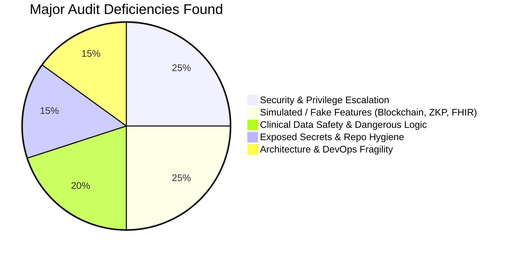
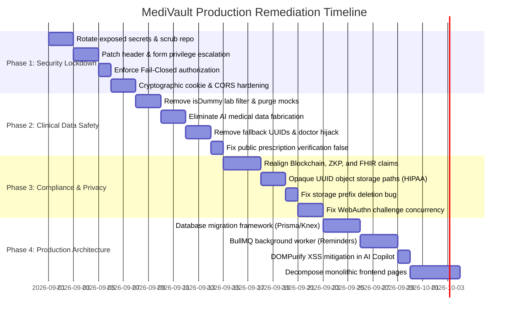

# MediVault — Production-Readiness Audit & Phased Remediation Masterplan

> **Document Status:** Active Engineering Roadmap  
> **Initial Assessment Grade:** `F (Pre-Alpha Prototype / Hackathon MVP)`  
> **Target Production Grade:** `A+ (Enterprise Healthcare / HIPAA & DPDPA Compliant)`  
> **Last Updated:** August 30, 2026

---

## Executive Summary

A comprehensive code, security, and architectural audit of the entire MediVault repository was conducted. While MediVault features sophisticated UI workflows and visual presentation, the internal implementation contains critical gaps that prevent it from functioning as a secure, production-grade medical platform.



This document serves as the **official audit ledger** and **phased remediation roadmap**. Each phase includes exact file references, technical explanations of why the existing code is unviable for production, and actionable engineering steps to achieve enterprise-level production readiness.

---

## Current Prototype vs. Production Standard

| Domain | Current Implementation (Prototype) | Production Standard Required |
| :--- | :--- | :--- |
| **Authentication & RBAC** | Trusting client-sent HTTP headers (`x-user-role`) & registration form claims; unverified cookies in Next.js middleware. | Cryptographically signed JWT verification on every request; server-authoritative role determination in DB; strict session validation. |
| **Authorization Safety** | "Fails Open" on DB errors in `validatePatientAccess` (grants access if DB is unreachable). | Strict "Fail Closed" (deny all access and return `503 Service Unavailable` if authorization check cannot complete). |
| **AI Reliability** | Fabricates medical diagnoses, prescriptions, and allergies when Gemini API is offline. | Never synthesize clinical data; queue jobs for retry (`PENDING_RETRY`) or return explicit processing errors. |
| **Emergency Profile** | Hardcoded `isDummy` filter erases real patient lab values (e.g. Hb 10.2, Glucose 108). | Database test-data cleanup; pure data-driven queries with no hardcoded value blacklists. |
| **Prescription Verification** | Displays invalid / counterfeit prescription IDs as "Verified Active" with Metformin & Telmisartan. | Returns 404 / Invalid status with tamper detection and pharmacist rejection alerts. |
| **Blockchain Integration** | `ethers.keccak256()` simulation returning hardcoded block number `4892104`. | Either real on-chain smart contract transactions with relayer infrastructure, or transparent removal of deceptive claims. |
| **ZKP & FHIR** | Marketing copy claiming "50ms ZKP Verification" and "100% FHIR Compliant" with 0 code backing. | Real HL7/FHIR R4 JSON schemas and actual Zero-Knowledge circuits, or complete removal from UI/docs. |
| **Storage & Privacy** | Plaintext patient names and emails stored directly in S3 storage paths (`patients/Name - email/...`). | Opaque UUID-based paths (`patients/{patientUuid}/documents/{docUuid}/...`) complying with HIPAA § 164.514 & DPDPA. |
| **Secrets & DevOps** | Plaintext production credentials in `auth.txt` & `deploy.txt`; 113MB executable in repository. | Environment-injected secrets via KMS / Doppler / Vault; `.gitignore` enforced; clean repository. |

---

# Part 1: Detailed Findings Catalogue

---

### Category 1: Critical Security & Authorization Vulnerabilities

#### 1.1 Privilege Escalation via Client HTTP Headers
* **File:** [`backend/src/middleware/auth.ts:125-134`](file:///c:/Users/HP/OneDrive/Desktop/MediVault/backend/src/middleware/auth.ts#L125-L134)
* **Code:**
  ```typescript
  if (!roleFoundInProfile) {
    const headerRole = (req.headers['x-user-role'] || req.headers['x-role'] || req.headers['role']) as string;
    if (headerRole) {
      const hRole = headerRole.toLowerCase().trim();
      if (hRole === 'doctor' || hRole === 'admin' || hRole === 'patient') {
        role = hRole;
      }
    }
  }
  ```
* **Risk:** The server blindly trusts unauthenticated, client-supplied HTTP headers. Any user can set `x-user-role: admin` in their request and execute administrative actions.
* **Auto-Provisioning Backdoor:** If `role === 'doctor'`, [`auth.ts:136-147`](file:///c:/Users/HP/OneDrive/Desktop/MediVault/backend/src/middleware/auth.ts#L136-L147) automatically inserts a record into `public.doctors` with status `'VERIFIED'` and an auto-generated fake license number (`DOC-XXXX`).

#### 1.2 Public Registration Role Elevation to Super Admin
* **File:** [`frontend/src/app/auth/page.tsx:420-424`](file:///c:/Users/HP/OneDrive/Desktop/MediVault/frontend/src/app/auth/page.tsx#L420-L424) & [`backend/schema.sql:284-286`](file:///c:/Users/HP/OneDrive/Desktop/MediVault/backend/schema.sql#L284-L286)
* **Code:**
  ```tsx
  {[
    { id: "patient", label: "Patient", icon: User },
    { id: "doctor", label: "Doctor", icon: Stethoscope },
    { id: "admin", label: "Facility", icon: Building2 },
  ]}
  ```
* **Risk:** In the public registration screen, the role selector labels `id: "admin"` as "Facility". The Supabase database trigger [`handle_new_user_v2()`](file:///c:/Users/HP/OneDrive/Desktop/MediVault/backend/schema.sql#L267) reads `NEW.raw_user_meta_data->>'role'` directly and assigns `role = 'admin'`. Any public visitor can register a Super Admin account.

#### 1.3 Authorization "Fails Open" on Database Errors
* **File:** [`backend/src/middleware/auth.ts:244-250`](file:///c:/Users/HP/OneDrive/Desktop/MediVault/backend/src/middleware/auth.ts#L244-L250) & [`lines 294-298`](file:///c:/Users/HP/OneDrive/Desktop/MediVault/backend/src/middleware/auth.ts#L294-L298)
* **Code:**
  ```typescript
  } catch (err: any) {
    if (isConnectionError(err)) {
      return next();
    }
  }
  ```
* **Risk:** In `validatePatientAccess`, if a database connection error or timeout occurs, the middleware calls `next()`. During database latency spikes, all authorization checks are bypassed, allowing arbitrary access to patient records.

#### 1.4 Client-Side Route Protection Bypassed by Insecure Cookies
* **File:** [`frontend/src/middleware.ts:15-25`](file:///c:/Users/HP/OneDrive/Desktop/MediVault/frontend/src/middleware.ts#L15-L25)
* **Code:**
  ```typescript
  const authCookie = request.cookies.get('medivault_auth')?.value;
  const isDemoCookie = request.cookies.get('medivault_is_demo')?.value;
  const roleCookie = request.cookies.get('medivault_role')?.value;
  const isAuthenticated = authCookie === 'true' || isDemoCookie === 'true' || hasSupabaseCookie;
  ```
* **Risk:** Next.js middleware performs zero cryptographic signature validation. Setting `document.cookie = "medivault_auth=true; medivault_role=admin;"` in browser DevTools bypasses route guards.

#### 1.5 Unauthenticated Storage and System Debug Endpoints
* **File:** [`backend/src/app.ts:76-107`](file:///c:/Users/HP/OneDrive/Desktop/MediVault/backend/src/app.ts#L76-L107)
* **Risk:**
  * `GET /system/storage-debug` returns the complete list of object storage keys (including patient full names and email addresses) to unauthenticated public callers.
  * `POST /system/migrate-storage` can be called unauthenticated by any bot to trigger batch object copying and database updates.

#### 1.6 Global WebAuthn Concurrency Vulnerability
* **File:** [`backend/src/services/webauthn.service.ts:253-258`](file:///c:/Users/HP/OneDrive/Desktop/MediVault/backend/src/services/webauthn.service.ts#L253-L258)
* **Code:**
  ```typescript
  const challengeRes = await query(
    `SELECT id, challenge FROM public.webauthn_challenges
     WHERE challenge_type = 'authentication' AND expires_at > NOW()
     ORDER BY created_at DESC LIMIT 1`
  );
  ```
* **Risk:** Authentication challenges are not bound to a user ID or session ID. The server verifies against the single most recent challenge platform-wide. Concurrent logins collide. Additionally, `requireUserVerification` is set to `false` ([line 278](file:///c:/Users/HP/OneDrive/Desktop/MediVault/backend/src/services/webauthn.service.ts#L278)).

#### 1.7 Permissive Wildcard CORS Configuration
* **File:** [`backend/src/app.ts:43`](file:///c:/Users/HP/OneDrive/Desktop/MediVault/backend/src/app.ts#L43)
* **Code:**
  ```typescript
  const isVercel = /^https:\/\/.*\.vercel\.app$/.test(origin);
  ```
* **Risk:** Any arbitrary malicious website hosted on Vercel (`https://malicious-attacker.vercel.app`) is allowed to make credentialed CORS requests to the backend.

---

### Category 2: "Fake It Till You Make It" (Simulated Subsystems)

#### 2.1 Simulated Polygon Blockchain Notarization
* **File:** [`backend/src/services/blockchain.service.ts:38-47`](file:///c:/Users/HP/OneDrive/Desktop/MediVault/backend/src/services/blockchain.service.ts#L38-L47)
* **Finding:** Generates a local `keccak256` hash and returns hardcoded `blockNumber: 4892104`, `network: 'Polygon Amoy Testnet (ChainID 80002)'`, and `verified: true`. `verifyOnChainHash()` unconditionally returns `isNotarized: true`. No smart contract call or gas transaction ever occurs.

#### 2.2 Fabricated Zero-Knowledge Proof (ZKP) Claims
* **Files:** [`frontend/src/app/components/CounterStats.tsx:16`](file:///c:/Users/HP/OneDrive/Desktop/MediVault/frontend/src/app/components/CounterStats.tsx#L16), [`doctor/dashboard/page.tsx:117`](file:///c:/Users/HP/OneDrive/Desktop/MediVault/frontend/src/app/doctor/dashboard/page.tsx#L117)
* **Finding:** UI displays "ZKP Session Active", "ZKP Verified", and "50ms ZKP Verification Time". No ZKP circuits, snarks, proofs, or verifier contracts exist in the codebase.

#### 2.3 Unimplemented FHIR R4 & HIPAA Compliance Claims
* **File:** [`frontend/src/app/components/CounterStats.tsx:17`](file:///c:/Users/HP/OneDrive/Desktop/MediVault/frontend/src/app/components/CounterStats.tsx#L17)
* **Finding:** UI displays "100% HIPAA & FHIR Compliant". There are no HL7/FHIR parsers, bundles, or schemas in the project.

#### 2.4 Fabricated Qdrant Vector Search Telemetry
* **Files:** [`backend/src/services/document.service.ts:352`](file:///c:/Users/HP/OneDrive/Desktop/MediVault/backend/src/services/document.service.ts#L352), [`admin.service.ts:2133-2140`](file:///c:/Users/HP/OneDrive/Desktop/MediVault/backend/src/services/admin.service.ts#L2133-L2140)
* **Finding:** Document indexing is an empty comment inside a `setImmediate` hook. The admin API calculates `total_vectors_indexed: indexedDocs * 4` to invent fake vector statistics.

#### 2.5 Mock ABHA & DigiLocker Integrations
* **File:** [`backend/src/services/government-id.service.ts:51-129`](file:///c:/Users/HP/OneDrive/Desktop/MediVault/backend/src/services/government-id.service.ts#L51-L129)
* **Finding:** Hardcodes sandbox OTP `'123456'`, generates random digits with `Math.random()`, hardcodes DOB `'1998-05-14'`, and downloads portrait photos from Unsplash. `importDigiLockerDocs` writes database rows for fake files (`digilocker/pmjay_card.pdf`) that do not exist in object storage.

#### 2.6 Mock Digital Prescription Signatures
* **File:** [`backend/src/services/prescription.service.ts:68-69`](file:///c:/Users/HP/OneDrive/Desktop/MediVault/backend/src/services/prescription.service.ts#L68-L69)
* **Finding:** Digital signatures are generated via `crypto.randomBytes(4).toString('hex')`. No cryptographic asymmetric keys (ECDSA/RSA) or legal e-Sign certificates are utilized.

---

### Category 3: Clinical Safety Hazards & Data Integrity Bugs

#### 3.1 Silent Medical History Fabrication on AI Failure
* **File:** [`backend/src/services/ai.service.ts:325-401`](file:///c:/Users/HP/OneDrive/Desktop/MediVault/backend/src/services/ai.service.ts#L325-L401)
* **Finding:** When Gemini API inference fails, `generateFallbackAnalysis()` synthesizes clinical data (Mild Iron Deficiency Anemia, Amoxicillin 500mg, Paracetamol 650mg, Penicillin allergy) and permanently commits it to the patient's real medical database.

#### 3.2 The `isDummy` Clinical Lab Erasure Bug
* **File:** [`backend/src/services/emergency.service.ts:1006-1028`](file:///c:/Users/HP/OneDrive/Desktop/MediVault/backend/src/services/emergency.service.ts#L1006-L1028)
* **Finding:** To filter out test data seeded during development, an `isDummy()` function filters out common medical values (Hemoglobin `10.2 g/dL`, Platelet count `240,000`, Fasting Glucose `108 mg/dL`). Real patients with these clinical values will have their genuine results deleted from emergency reports.

#### 3.3 Public Prescription Verification Displays False Verification for Invalid IDs
* **File:** [`frontend/src/app/verify/rx/[id]/page.tsx:56-98`](file:///c:/Users/HP/OneDrive/Desktop/MediVault/frontend/src/app/verify/rx/%5Bid%5D/page.tsx#L56-L98)
* **Finding:** If an API lookup fails or returns 404, the catch handler sets a hardcoded mock prescription: `verified: true`, `Dr. Sarah Jenkins`, `Metformin 500mg & Telmisartan 40mg`. Fraudulent or non-existent prescription codes appear authentic.

#### 3.4 Silent Dropping of Prescriptions on Database Failure
* **File:** [`backend/src/services/prescription.service.ts:244-264`](file:///c:/Users/HP/OneDrive/Desktop/MediVault/backend/src/services/prescription.service.ts#L244-L264)
* **Finding:** When a database error occurs during prescription issuance, the backend returns a mock object as if it succeeded. The doctor's UI reports success, but the prescription is permanently lost.

#### 3.5 Arbitrary Doctor Reassignment
* **File:** [`backend/src/services/prescription.service.ts:117-120`](file:///c:/Users/HP/OneDrive/Desktop/MediVault/backend/src/services/prescription.service.ts#L117-L120)
* **Finding:** If a provided doctor UUID is invalid, the backend runs `SELECT id FROM public.doctors LIMIT 1` and assigns the prescription to the first doctor in the database.

#### 3.6 Cross-Patient Data Bleed via Hardcoded Fallback UUID
* **Files:** [`ai.controller.ts:9`](file:///c:/Users/HP/OneDrive/Desktop/MediVault/backend/src/controllers/ai.controller.ts#L9), [`copilot.controller.ts:19`](file:///c:/Users/HP/OneDrive/Desktop/MediVault/backend/src/controllers/copilot.controller.ts#L19), [`document.repository.ts:16-17`](file:///c:/Users/HP/OneDrive/Desktop/MediVault/backend/src/repositories/document.repository.ts#L16-L17), [`reports/page.tsx:98, 253`](file:///c:/Users/HP/OneDrive/Desktop/MediVault/frontend/src/app/patient/reports/page.tsx#L98)
* **Finding:** When `patient_id` is missing, controllers default to `'a3b8c9d0-1e2f-4a5b-8c9d-0e1f2a3b4c5d'`. Unauthenticated or incomplete requests cross-contaminate chat logs and reports under that shared UUID.

---

### Category 4: Repository Hygiene, DevOps & Infrastructure

#### 4.1 Committed Production Secrets & Binaries in Repository Directory
* **Files:** [`auth.txt`](file:///c:/Users/HP/OneDrive/Desktop/MediVault/auth.txt), [`deploy.txt`](file:///c:/Users/HP/OneDrive/Desktop/MediVault/deploy.txt), `minio.exe` (113MB)
* **Finding:** Google OAuth client secret, Supabase Service Role Key, raw PostgreSQL connection strings with passwords, Gemini API keys, and Nvidia NIM API keys are present in plain text in the project folder.

#### 4.2 Protected Health Information (PII) in Object Storage Keys
* **File:** [`backend/src/storage/minioStorage.ts:38-44`](file:///c:/Users/HP/OneDrive/Desktop/MediVault/backend/src/storage/minioStorage.ts#L38-L44)
* **Finding:** Storage paths are formatted as `patients/Full Name - email@domain.com/documents/...`. Under HIPAA § 164.514 and GDPR, unencrypted names and email addresses in S3 keys leak into bucket logs, access logs, and error traces.

#### 4.3 Destructive Prefix Deletion Bug
* **File:** [`backend/src/storage/minioStorage.ts:334-343`](file:///c:/Users/HP/OneDrive/Desktop/MediVault/backend/src/storage/minioStorage.ts#L334-L343)
* **Finding:** `folderPrefix` is resolved by stripping the last slash. If a key is structured as `patients/John Doe/original.pdf`, `folderPrefix` evaluates to `patients/John Doe`. Deleting a single document recursively deletes all documents in that patient's folder.

#### 4.4 Ephemeral Local Disk Storage Fallback
* **File:** [`backend/src/storage/minioStorage.ts:233-248`](file:///c:/Users/HP/OneDrive/Desktop/MediVault/backend/src/storage/minioStorage.ts#L233-L248)
* **Finding:** When MinIO is unreachable, files are written to `./uploads/` on the server's local disk. On ephemeral hosting platforms (Render, Vercel, Railway, Kubernetes), container restarts permanently delete these files.

#### 4.5 Destructive Schema Scripts & In-Process Recurring Schedulers
* **Files:** [`backend/schema.sql:11-29`](file:///c:/Users/HP/OneDrive/Desktop/MediVault/backend/schema.sql#L11-L29), [`clean_db.ts:60`](file:///c:/Users/HP/OneDrive/Desktop/MediVault/backend/src/scripts/clean_db.ts#L60), [`app.ts:172`](file:///c:/Users/HP/OneDrive/Desktop/MediVault/backend/src/app.ts#L172)
* **Finding:**
  * `schema.sql` begins with `DROP TABLE IF EXISTS ... CASCADE`, risking catastrophic data loss if executed against production.
  * `clean_db.ts` contains a `--logs` command that executes `DELETE FROM public.audit_logs;`, violating HIPAA § 164.312(b) audit log retention mandates.
  * In-process `setInterval` for medication reminders causes duplicate dispatches and race conditions when scaled to multiple instances.

---

### Category 5: Frontend & UI/UX Issues

#### 5.1 Stored XSS Vulnerability in AI Copilot
* **File:** [`frontend/src/app/patient/ai-copilot/page.tsx:101-123`](file:///c:/Users/HP/OneDrive/Desktop/MediVault/frontend/src/app/patient/ai-copilot/page.tsx#L101-L123)
* **Finding:** `renderMarkdown()` replaces markdown syntax with raw HTML strings and injects them via `dangerouslySetInnerHTML` without HTML sanitization (such as `DOMPurify`), enabling script injection from AI output or crafted prompts.

#### 5.2 Monolithic Client-Side Bundles
* **Files:**
  * [`frontend/src/app/page.tsx`](file:///c:/Users/HP/OneDrive/Desktop/MediVault/frontend/src/app/page.tsx): 1,515 lines (88 KB)
  * [`frontend/src/app/patient/reports/page.tsx`](file:///c:/Users/HP/OneDrive/Desktop/MediVault/frontend/src/app/patient/reports/page.tsx): 1,187 lines (55 KB)
  * [`frontend/src/app/patient/ai-copilot/page.tsx`](file:///c:/Users/HP/OneDrive/Desktop/MediVault/frontend/src/app/patient/ai-copilot/page.tsx): 1,403 lines (60 KB)
  * [`frontend/src/app/patient/emergency/page.tsx`](file:///c:/Users/HP/OneDrive/Desktop/MediVault/frontend/src/app/patient/emergency/page.tsx): 974 lines (45 KB)
  * [`backend/src/services/admin.service.ts`](file:///c:/Users/HP/OneDrive/Desktop/MediVault/backend/src/services/admin.service.ts): 2,533 lines (93 KB)
* **Finding:** Violates single-responsibility design; inlines mock data, state management, and view components in single files.

---

# Part 2: Phased Remediation Masterplan



---

## Phase 1: Critical Security Lockdown & Secrets Containment (Week 1)

> **Objective:** Close all administrative backdoors, eliminate plain text credential leaks, enforce fail-closed authorization, and secure boundary routes.

### Task 1.1: Secrets Invalidation & Git Scrubbing
* [ ] Invalidate and rotate all exposed credentials:
  * Supabase Database Password & Service Role Key
  * Google OAuth Client Secret
  * Google Gemini API Key
  * NVIDIA NIM API Key
  * Backblaze B2 Application Key
  * VAPID Push Notification Private Key
* [ ] Delete `auth.txt`, `deploy.txt`, and `minio.exe` from the workspace.
* [ ] Verify `.gitignore` explicitly ignores `.env`, `*.txt`, `*.exe`, `uploads/`, and `minio_data/`.

### Task 1.2: Remove Header-Based Role Elevation & Public Admin Registration
* [ ] In [`backend/src/middleware/auth.ts`](file:///c:/Users/HP/OneDrive/Desktop/MediVault/backend/src/middleware/auth.ts):
  * Completely remove lines 125–134 (reading `x-user-role`, `x-role`, `role` from HTTP headers).
  * Remove the automatic insertion into `public.doctors` on line 136. Doctor status must require administrative approval.
* [ ] In [`frontend/src/app/auth/page.tsx`](file:///c:/Users/HP/OneDrive/Desktop/MediVault/frontend/src/app/auth/page.tsx#L420):
  * Remove `{ id: "admin", label: "Facility", icon: Building2 }` from the registration options. Public signup must only permit `patient` or `doctor` registration.
* [ ] In [`backend/schema.sql`](file:///c:/Users/HP/OneDrive/Desktop/MediVault/backend/schema.sql#L284):
  * Update `handle_new_user_v2()` trigger to restrict public signups to `'patient'::user_role` or `'doctor'::user_role`. Admin roles must only be granted via database scripts or existing Super Admins.

### Task 1.3: Enforce Fail-Closed Authorization
* [ ] In [`backend/src/middleware/auth.ts:244`](file:///c:/Users/HP/OneDrive/Desktop/MediVault/backend/src/middleware/auth.ts#L244) and [`line 294`](file:///c:/Users/HP/OneDrive/Desktop/MediVault/backend/src/middleware/auth.ts#L294):
  * Replace `if (isConnectionError(err)) { return next(); }` with:
    ```typescript
    return sendError(res, 503, 'Authorization service temporarily unavailable. Access denied.');
    ```

### Task 1.4: Cryptographic Cookie Verification in Next.js Middleware
* [ ] In [`frontend/src/middleware.ts`](file:///c:/Users/HP/OneDrive/Desktop/MediVault/frontend/src/middleware.ts):
  * Remove reliance on raw unverified cookie strings `medivault_auth === 'true'` and `medivault_role`.
  * Use `@supabase/ssr` to validate the cryptographic Supabase auth session token on the server before allowing access to `/patient/*`, `/doctor/*`, or `/admin/*`.

### Task 1.5: Secure Diagnostic & Storage Endpoints
* [ ] In [`backend/src/app.ts:76-107`](file:///c:/Users/HP/OneDrive/Desktop/MediVault/backend/src/app.ts#L76-L107):
  * Add `authenticateJWT` and `authorizeRoles('admin')` to `/system/storage-debug` and `/system/migrate-storage`.

### Task 1.6: Restrict CORS Whitelist
* [ ] In [`backend/src/app.ts:43`](file:///c:/Users/HP/OneDrive/Desktop/MediVault/backend/src/app.ts#L43):
  * Replace `const isVercel = /^https:\/\/.*\.vercel\.app$/.test(origin);` with an explicit array loaded from `process.env.ALLOWED_ORIGINS`.

---

## Phase 2: Clinical Data Safety & Integrity Hardening (Week 2)

> **Objective:** Prevent data loss, eliminate clinical hallucinations/fabrications, fix prescription verification, and purge cross-session data bleeding.

### Task 2.1: Purge the `isDummy` Lab Filter
* [ ] In [`backend/src/services/emergency.service.ts:1006-1028`](file:///c:/Users/HP/OneDrive/Desktop/MediVault/backend/src/services/emergency.service.ts#L1006-L1028):
  * Completely remove `DUMMY_LAB_NAMES`, `DUMMY_VALS`, and the `isDummy()` function.
  * Ensure genuine patient lab results are never filtered out.
  * Create a standalone SQL migration script to delete historical test rows matching demo patient IDs from the database.

### Task 2.2: Eliminate Fabricated AI Fallbacks
* [ ] In [`backend/src/services/ai.service.ts:325-401`](file:///c:/Users/HP/OneDrive/Desktop/MediVault/backend/src/services/ai.service.ts#L325-L401):
  * Remove `generateFallbackAnalysis()`.
  * When Gemini API calls fail, return an explicit error or mark document status as `ANALYSIS_FAILED` / `PENDING_RETRY`. Never write fictional medications, diagnoses, or allergies into a patient's database records.

### Task 2.3: Remove Shared Dummy UUID
* [ ] Search and eliminate `'a3b8c9d0-1e2f-4a5b-8c9d-0e1f2a3b4c5d'` from:
  * `backend/src/controllers/ai.controller.ts:9`
  * `backend/src/controllers/copilot.controller.ts:19`
  * `backend/src/repositories/document.repository.ts:16-17`
  * `frontend/src/app/patient/reports/page.tsx:98, 253`
* [ ] If `patient_id` is missing in any controller, return `400 Bad Request: Patient identifier is required.`

### Task 2.4: Prevent Random Doctor Prescription Hijacking
* [ ] In [`backend/src/services/prescription.service.ts:117-120`](file:///c:/Users/HP/OneDrive/Desktop/MediVault/backend/src/services/prescription.service.ts#L117-L120):
  * Remove `SELECT id FROM public.doctors LIMIT 1`.
  * If `doctorId` is not found in `public.doctors`, reject the request with `400 Bad Request: Prescribing physician is not registered or verified.`

### Task 2.5: Fix Public Prescription Verification Screen
* [ ] In [`frontend/src/app/verify/rx/[id]/page.tsx:56-98`](file:///c:/Users/HP/OneDrive/Desktop/MediVault/frontend/src/app/verify/rx/%5Bid%5D/page.tsx#L56-L98):
  * Remove the fallback object that displays invalid prescriptions as verified.
  * If the prescription is not found in the database, display an explicit `INVALID_PRESCRIPTION` or `EXPIRED_PRESCRIPTION` banner with a notice for pharmacists.

### Task 2.6: Prevent Silent Prescription Drops on Database Outages
* [ ] In [`backend/src/services/prescription.service.ts:244-264`](file:///c:/Users/HP/OneDrive/Desktop/MediVault/backend/src/services/prescription.service.ts#L244-L264):
  * Remove the catch handler returning a mock prescription object on DB error.
  * Throw an error so the frontend displays a failure state, ensuring the doctor re-attempts issuance.

---

## Phase 3: Compliance, Privacy & Truth in Software (Week 3)

> **Objective:** Align marketing and UI claims with real technical capabilities, enforce HIPAA privacy on storage keys, fix WebAuthn challenge concurrency, and secure S3 file lifecycle.

### Task 3.1: Realign Blockchain, ZKP, and FHIR Claims
* [ ] **Blockchain Decision:**
  * *Option A (Recommended for standard SaaS):* Remove "Polygon Amoy Blockchain Notarization" claims and fake transaction hashes from UI and documentation. Use standard database audit logging with cryptographic hash chaining (Merkle trees).
  * *Option B (Web3 requirement):* Deploy `MedicalRecordVerifier.sol` to Polygon testnet, implement an Ethers.js wallet relayer with private key in secure KMS, and broadcast real transactions.
* [ ] **ZKP & FHIR Realignment:**
  * Remove references to "50ms ZKP Verification" and "ZKP Session Active" across the landing page, navbar, and doctor dashboard.
  * Remove "100% FHIR Compliant" until standard FHIR R4 Bundle exports are implemented.

### Task 3.2: Anonymize Object Storage Keys (HIPAA § 164.514)
* [ ] In [`backend/src/storage/minioStorage.ts`](file:///c:/Users/HP/OneDrive/Desktop/MediVault/backend/src/storage/minioStorage.ts):
  * Deprecate human-readable storage keys (`patients/Name - email/...`).
  * Enforce UUID-only storage hierarchy:
    ```
    patients/{patientUuid}/documents/{documentCategory}/{documentUuid}/original.{ext}
    ```
  * Update database paths and remove migration scripts that inject PII into S3 keys.

### Task 3.3: Fix Destructive Folder Prefix Deletion Bug
* [ ] In [`backend/src/storage/minioStorage.ts:334-343`](file:///c:/Users/HP/OneDrive/Desktop/MediVault/backend/src/storage/minioStorage.ts#L334-L343):
  * Restrict `removeObjects` strictly to `storageKey` and its explicit metadata companion `storageKey.replace('/original.', '/metadata.json')`.
  * Never delete all objects under the parent directory prefix.

### Task 3.4: Fix WebAuthn Challenge Concurrency Race Condition
* [ ] In [`backend/src/services/webauthn.service.ts`](file:///c:/Users/HP/OneDrive/Desktop/MediVault/backend/src/services/webauthn.service.ts):
  * Pass a session token or challenge ID cookie to the frontend during challenge generation.
  * Match challenges during assertion verification by `challenge_id` or `session_token`, rather than `ORDER BY created_at DESC LIMIT 1`.
  * Enable `requireUserVerification: true` for biometric assurance.

---

## Phase 4: Enterprise Architecture, Reliability & Refactoring (Week 4)

> **Objective:** Transition to reliable background job workers, implement DOMPurify, clean up database schemas, and decompose monolithic frontend files.

### Task 4.1: Database Migration Safety
* [ ] In [`backend/schema.sql`](file:///c:/Users/HP/OneDrive/Desktop/MediVault/backend/schema.sql):
  * Remove `DROP TABLE IF EXISTS ... CASCADE`.
* [ ] In [`backend/src/config/migrate.ts`](file:///c:/Users/HP/OneDrive/Desktop/MediVault/backend/src/config/migrate.ts):
  * Transition from running dynamic DDL queries on every server startup to a formal migration manager (e.g. `Prisma Migrate`, `Knex`, or `node-pg-migrate`).
* [ ] In [`backend/src/scripts/clean_db.ts:60`](file:///c:/Users/HP/OneDrive/Desktop/MediVault/backend/src/scripts/clean_db.ts#L60):
  * Remove the option to truncate `public.audit_logs` to maintain compliance with HIPAA § 164.312(b).

### Task 4.2: Asynchronous Job Processing for Medication Reminders
* [ ] In [`backend/src/app.ts:172`](file:///c:/Users/HP/OneDrive/Desktop/MediVault/backend/src/app.ts#L172):
  * Extract medication reminder dispatching from the in-process Node.js `setInterval`.
  * Implement a Redis-backed queue (`BullMQ`) or scheduled cron job to prevent duplicate dispatches when scaling horizontally.

### Task 4.3: Sanitize AI Copilot Markdown (XSS Prevention)
* [ ] In [`frontend/src/app/patient/ai-copilot/page.tsx:101-123`](file:///c:/Users/HP/OneDrive/Desktop/MediVault/frontend/src/app/patient/ai-copilot/page.tsx#L101-L123):
  * Replace the regex-based `renderMarkdown` with `react-markdown` and `DOMPurify` / `rehype-sanitize`.

### Task 4.4: Decompose Monolithic Frontend Pages
* [ ] Refactor oversized pages into modular components:
  * [`frontend/src/app/page.tsx`](file:///c:/Users/HP/OneDrive/Desktop/MediVault/frontend/src/app/page.tsx) (1,515 lines) $\rightarrow$ Move demo cards, features, and FAQs to `src/app/components/landing/`.
  * [`frontend/src/app/patient/reports/page.tsx`](file:///c:/Users/HP/OneDrive/Desktop/MediVault/frontend/src/app/patient/reports/page.tsx) (1,187 lines) $\rightarrow$ Extract UploadModal, FilterBar, and ReportTable.
  * [`frontend/src/app/patient/ai-copilot/page.tsx`](file:///c:/Users/HP/OneDrive/Desktop/MediVault/frontend/src/app/patient/ai-copilot/page.tsx) (1,403 lines) $\rightarrow$ Extract MessageList, ChatInput, and InsightsSidebar.
  * [`backend/src/services/admin.service.ts`](file:///c:/Users/HP/OneDrive/Desktop/MediVault/backend/src/services/admin.service.ts) (2,533 lines) $\rightarrow$ Split into `AdminUserService`, `AdminDoctorService`, and `AdminSystemMetricsService`.

### Task 4.5: Consolidate OCR Microservices
* [ ] Consolidate [`ocr-service/`](file:///c:/Users/HP/OneDrive/Desktop/MediVault/ocr-service) and [`services/prescription-ai/`](file:///c:/Users/HP/OneDrive/Desktop/MediVault/services/prescription-ai) into a single canonical Python microservice. Remove duplicated dependencies and virtual environments.

---

## Verification & Acceptance Checklist

| Phase | Milestone | Acceptance Criteria |
| :---: | :--- | :--- |
| **1** | **Security Lockdown** | Passing automated penetration test: Attempting to send `x-user-role: admin` returns 403; public signup does not allow admin role; unverified cookies in Next.js middleware redirect to `/auth`; DB outage returns 503 instead of bypassing auth. |
| **2** | **Clinical Safety** | Automated test: Patient with Hb `10.2` retains data in emergency view; Gemini API timeout returns error state without fabricating diagnoses; invalid prescription ID in `/verify/rx/[id]` returns 404. |
| **3** | **Compliance & Privacy** | S3 bucket keys contain only UUIDs; single file deletion deletes only target file and metadata; WebAuthn challenge verification passes under concurrent automated logins. |
| **4** | **Architecture** | Server starts without running inline DDL; reminder queue runs independently via BullMQ; Copilot renders sanitized markdown safe from XSS payloads. |
