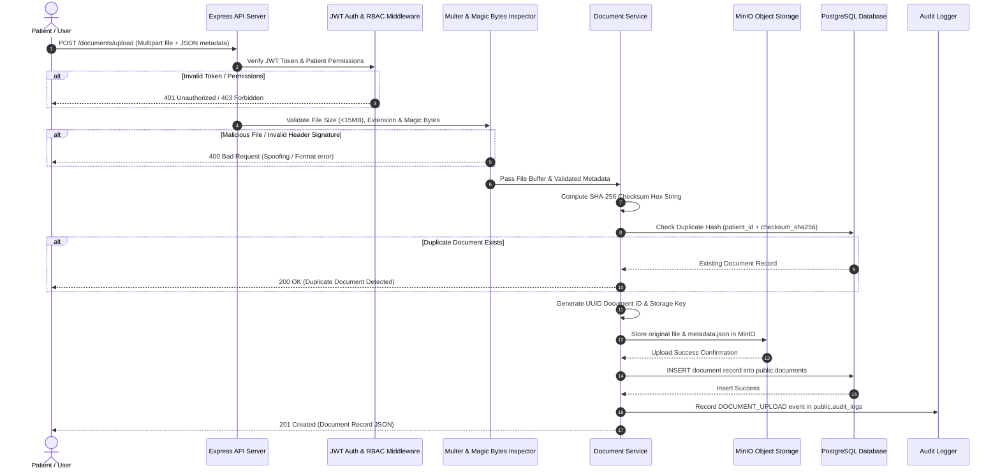

# MediVault Document Management - Upload Flow Documentation

```mermaid
sequenceDiagram
    autonumber
    actor Patient as Patient / User
    participant API as Express API Server
    participant Auth as JWT Auth & RBAC Middleware
    participant Upload as Multer & Magic Bytes Inspector
    participant Service as Document Service
    participant Storage as MinIO Object Storage
    participant DB as PostgreSQL Database
    participant Audit as Audit Logger

    Patient->>API: POST /documents/upload (Multipart file + JSON metadata)
    API->>Auth: Verify JWT Token & Patient Permissions
    alt Invalid Token / Permissions
        Auth-->>Patient: 401 Unauthorized / 403 Forbidden
    end

    API->>Upload: Validate File Size (<15MB), Extension & Magic Bytes
    alt Malicious File / Invalid Header Signature
        Upload-->>Patient: 400 Bad Request (Spoofing / Format error)
    end

    Upload->>Service: Pass File Buffer & Validated Metadata
    Service->>Service: Compute SHA-256 Checksum Hex String
    Service->>DB: Check Duplicate Hash (patient_id + checksum_sha256)
    
    alt Duplicate Document Exists
        DB-->>Service: Existing Document Record
        Service-->>Patient: 200 OK (Duplicate Document Detected)
    end

    Service->>Service: Generate UUID Document ID & Storage Key
    Service->>Storage: Store original file & metadata.json in MinIO
    Storage-->>Service: Upload Success Confirmation
    
    Service->>DB: INSERT document record into public.documents
    DB-->>Service: Insert Success
    
    Service->>Audit: Record DOCUMENT_UPLOAD event in public.audit_logs
    Service-->>Patient: 201 Created (Document Record JSON)
```
